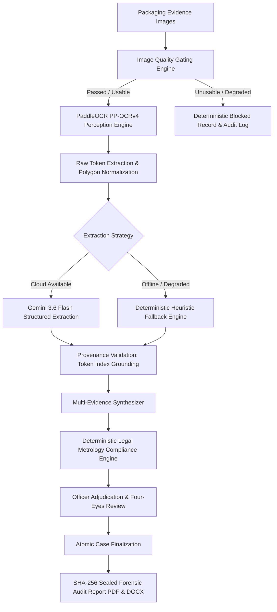

# CompliScan LM 🔍
### *Deterministic AI Compliance & Forensic Audit Platform for Legal Metrology*

[](https://www.python.org/)
[](https://fastapi.tiangolo.com/)
[](https://react.dev/)
[](https://www.typescriptlang.org/)
[](https://vitejs.dev/)
[](https://pytest.org/)
[](LICENSE)

---

## 📌 Executive Overview

**CompliScan LM** is an enterprise-grade, forensic-grade compliance inspection platform designed for enforcement officers, legal metrology inspectors, and consumer protection authorities. It automates statutory label verification on pre-packaged commodities under the **Legal Metrology (Packaged Commodities) Rules, 2011 (LMPC Rules)** while maintaining strictly deterministic, evidence-grounded judicial integrity.

> **⚖️ Core Judicial Principle: Zero LLM Legal Decision-Making**  
> Large Language Models (LLMs) are strictly restricted to **semantic text structuring** and token extraction. All legal applicability determinations and statutory compliance evaluations are executed by a **100% deterministic rule engine** with cryptographic provenance and tamper-evident audit trails admissible in legal proceedings.

---

## 🏛️ Statutory Declarations Evaluated

CompliScan LM inspects and cross-validates all 7 mandatory declaration domains prescribed under **Rule 6(1)** of the *Legal Metrology (Packaged Commodities) Rules, 2011*:

| # | Statutory Domain | Legal Citation | Deterministic Evaluation Standard |
|---|---|---|---|
| 1 | **Manufacturer / Packer / Importer** | `Rule 6(1)(a)` | Verifies presence of registered entity name and complete geographical address. |
| 2 | **Generic / Common Commodity Name** | `Rule 6(1)(b)` | Validates standard commodity naming (not solely trade branding). |
| 3 | **Net Quantity & Unit of Measure** | `Rule 6(1)(c)` | Enforces standard legal metrology units (`g`, `kg`, `ml`, `l`, `m`, `N`, `U`) and non-negative numeric quantities. |
| 4 | **Date of Manufacture / Packing / Import** | `Rule 6(1)(d)` | Validates mandatory month (`MM`) and year (`YYYY`) formatting and chronological plausibility. |
| 5 | **Maximum Retail Price (MRP)** | `Rule 6(1)(e)` | Verifies numerical price declaration and mandatory inclusion of `"inclusive of all taxes"` statement. |
| 6 | **Consumer Care Grievance Redressal** | `Rule 6(1)(f)` | Validates complete contact channels (telephone/toll-free helpline, email address, physical address, and designated officer). |
| 7 | **Country of Origin** | `Rule 6(1)(da)` | Deterministically assessed based on origin status (Mandatory for imported goods under G.S.R. 629(E); exempt for domestic goods). |

---

## 🚀 Key Architectural Features

- **🔬 Deterministic Dual Perception Pipeline**:
  - **PaddleOCR (PP-OCRv4 ONNX Runtime)**: Local, high-throughput text extraction generating bounded polygon tokens.
  - **Gemini 3.6 Flash Semantic Structuring**: High-precision token grounding with source token index provenance mapping.
  - **Deterministic Heuristic Fallback**: Resilient offline regex parser for uninterrupted operations during degraded cloud connectivity.
- **🛡️ Forensic Evidence Chain & Immutability**:
  - Uploaded image binaries are hashed with **SHA-256** upon receipt and sealed against post-upload tampering.
  - Quality assessment gating screens for blur, underexposure, and resolution before perception dispatch.
- **👥 Four-Eyes Review & Adjudication Workflow**:
  - **Field Inspector**: Uploads multi-angle packaging photos, reviews extracted perception tokens, and submits inspection packages.
  - **Senior Reviewing Officer**: Reviews declaration matrices, evidence links, and adjudicates disputed or ambiguous findings.
  - **Atomic Finalization**: Once signed, findings and evidence are permanently locked (`is_immutable = True`).
- **📄 Court-Admissible Report Generation**:
  - Auto-compiles finalized cases into bilingual, forensic **PDF & DOCX Inspection Reports** complete with cryptographic SHA-256 integrity seals, annexures, and visual token overlays.
- **🔐 Enterprise Security & IDOR Isolation**:
  - Role-Based Access Control (**RBAC**) powered by Supabase Auth / JWT.
  - Strict multi-tenant row-level scoping and SQL injection mitigation across all repository search APIs.

---

## 🏗️ System Architecture



---

## 🛠️ Technology Stack

### Backend
- **Framework**: FastAPI (Python 3.12+)
- **ORM & Database**: SQLAlchemy 2.0 (Asyncio) + SQLite / PostgreSQL (Supabase)
- **Computer Vision / OCR**: PaddleOCR (PP-OCRv4 ONNX), OpenCV, Pillow
- **AI / LLM Engine**: Google GenAI SDK (`gemini-3.6-flash`) with strict provenance verification
- **Document Generation**: ReportLab (PDF) & `python-docx` (DOCX)
- **Validation**: Pydantic v2 Settings & Schemas

### Frontend
- **Framework**: React 18 with TypeScript
- **Build Tool**: Vite 5
- **Styling**: Vanilla CSS Design Tokens & Tailwind CSS
- **Icons**: Lucide React
- **State & HTTP**: Axios, React Router v6

---

## 📦 Installation & Setup Guide

### Prerequisites
- **Python**: `3.12` or higher
- **Node.js**: `18.x` or higher
- **pnpm** or **npm**
- **Git**

---

### 1. Clone Repository
```bash
git clone https://github.com/aryaveerz/CompliScan.git
cd CompliScan
```

---

### 2. Backend Setup

1. **Create and activate a virtual environment**:
   ```bash
   # Windows (PowerShell)
   python -m venv venv
   .\venv\Scripts\Activate.ps1

   # Linux / macOS
   python3 -m venv venv
   source venv/bin/activate
   ```

2. **Install Python dependencies**:
   ```bash
   pip install -r backend/requirements.txt
   ```

3. **Configure Environment Variables**:
   Create a `.env` file in the root directory:
   ```env
   # Database & Storage
   DATABASE_URL=sqlite+aiosqlite:///./compliscan.db
   SYNC_DATABASE_URL=sqlite:///./compliscan.db
   STORAGE_BACKEND=local
   LOCAL_STORAGE_DIR=backend/uploads

   # Security & Authentication
   SECRET_KEY=your_secure_development_secret_key_here
   ALGORITHM=HS256
   ACCESS_TOKEN_EXPIRE_MINUTES=480

   # Gemini Semantic Extraction Engine
   GEMINI_API_KEY=your_google_gemini_api_key_here
   GEMINI_MODEL=gemini-3.6-flash

   # Worker Settings
   WORKER_LEASE_SECONDS=60
   WORKER_POLL_INTERVAL_SECONDS=2.0
   ```

4. **Initialize Database**:
   ```bash
   python -m backend.app.db.init_db
   ```

5. **Start the Backend API Server**:
   ```bash
   uvicorn backend.app.main:app --host 0.0.0.0 --port 8000 --reload
   ```
   *The interactive API documentation is available at `http://localhost:8000/docs`.*

---

### 3. Frontend Setup

1. **Navigate to the frontend directory**:
   ```bash
   cd frontend
   ```

2. **Install Node dependencies**:
   ```bash
   npm install
   # or
   pnpm install
   ```

3. **Start the Frontend Development Server**:
   ```bash
   npm run dev
   ```
   *The application will launch at `http://localhost:5173`.*

---

## 🧪 Testing & Verification

CompliScan LM maintains an exhaustive test suite covering unit, integration, and security test cases.

```bash
# Run the complete test suite with verbose output
pytest -v backend/tests/

# Run specific domain test suites
pytest -v backend/tests/test_compliance.py           # Deterministic legal rules
pytest -v backend/tests/test_extraction.py           # Token extraction & provenance
pytest -v backend/tests/test_image_quality.py        # Quality assessment gating
pytest -v backend/tests/test_ocr.py                  # OCR perception pipeline
pytest -v backend/tests/test_remediation_suite.py    # Multi-evidence corroboration
pytest -v backend/tests/test_phase5.py               # Forensic PDF/DOCX reports & RBAC
```

---

## 📂 Repository Structure

```
CompliScan/
├── backend/
│   ├── app/
│   │   ├── api/
│   │   │   └── v1/                # REST endpoints (auth, inspections, compliance, reports)
│   │   ├── core/                  # Configuration, logging, error definitions
│   │   ├── db/                    # Database models and session management
│   │   ├── models/                # SQLAlchemy ORM database entities
│   │   ├── schemas/               # Pydantic schemas and serialization models
│   │   └── services/              # Core business engines:
│   │       ├── applicability_service.py      # Statutory applicability engine
│   │       ├── compliance_service.py         # Deterministic LMPC rule evaluator
│   │       ├── extraction_service.py         # Semantic structuring & heuristic parser
│   │       ├── image_quality_service.py      # Perception screening & quality gate
│   │       ├── ocr_service.py                # PaddleOCR PP-OCRv4 perception
│   │       ├── pdf_report_service.py         # Forensic PDF generation with SHA-256 seal
│   │       └── synthesis_service.py          # Multi-evidence synthesis engine
│   └── tests/                     # 151+ Unit and Integration Pytest test suites
├── frontend/
│   ├── src/
│   │   ├── components/            # Reusable UI components & canvas overlays
│   │   ├── pages/                 # Inspection workspaces, review queues, audit logs
│   │   ├── services/              # API clients & authentication helpers
│   │   └── types/                 # TypeScript interfaces and domain types
├── shared/
│   └── domain/                    # Canonical constants, enums, and legal rule definitions
├── docs/                          # Architecture specifications, runbooks, and statutory guides
├── requirements.txt               # Top-level Python dependency manifest
└── README.md                      # Project documentation
```

---

## 🔒 Security & Judicial Integrity Policy

- **Token Provenance Protection**: Any extracted observation that references out-of-range or non-existent token indices is immediately rejected by `validate_provenance()`.
- **Tamper Evidence**: Once an inspection case is finalized, all evidence records, extracted declarations, and compliance findings are set to `is_immutable = True` and cryptographically locked.
- **Audit Traceability**: Every user action, system extraction, and officer review is chronologically recorded in immutable `AuditEvent` logs with UTC timestamps and actor IDs.

---

## 👥 Authors & Acknowledgements

- **Lead Architecture & Engineering**: CompliScan LM Core Team
- **Regulatory Framework**: Department of Consumer Affairs, Government of India (*Legal Metrology Act, 2009 & Packaged Commodities Rules, 2011*)

---

## 📄 License

CompliScan LM is distributed under an Enterprise / Government Technology License. See [LICENSE](LICENSE) for details.
