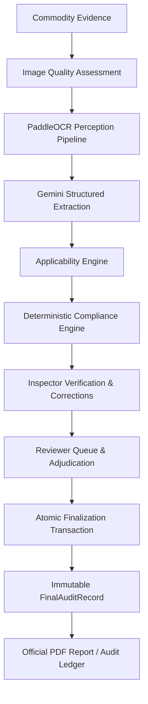

# NEXT PHASE DISCOVERY REPORT
## CompliScan LM — Phase 5: Reports, Repository & Operational Dashboard Intelligence

**Document Version:** 1.0
**Status:** Approved for Implementation Preparation
**Scope Context:** Post-Phase 4 Discovery & Transition
**Repository:** [CompliScan LM](file:///g:/CompliScan)

---

## 1. Current System State

CompliScan LM is an AI-assisted inspection and regulatory compliance platform engineered for India's Legal Metrology (Packaged Commodities) Rules, 2011.

- **Completed & Verified Foundations:** Phases 1, 2.1, 2.2, 2.3, 3, and 4 are completely implemented, verified, and frozen.
- **Backend Architecture:** Modular FastAPI application connected to PostgreSQL (Supabase).
- **Database Schema:** Fully synchronized with Alembic at HEAD (`e5f6a7b8c9d0_add_phase4_tables`), containing `inspections`, `evidence_files`, `ocr_results`, `extractions`, `rule_evaluations`, `inspection_corrections`, `reviewer_determinations`, `evidence_requests`, `final_audit_records`, and `audit_events`.
- **Automated Test Suite:** 65 unit and integration tests passing in 17.15s with zero regressions.
- **Frontend Architecture:** React 18 / TypeScript / Vite application compiling cleanly with zero TypeScript errors (`npm run build` PASS).
- **Security & Integrity:** Strict Role-Based Access Control (Inspector, Reviewer, Admin), IDOR protection, evidence hashing (SHA-256), and append-only audit event recording.

---

## 2. Completed Phases

| Phase | Title | Core Functional Deliverables | Status |
| :--- | :--- | :--- | :--- |
| **Phase 1** | Foundation & Evidence Lifecycle | Auth, Supabase DB integration, RBAC, Evidence upload, MIME/size validation, SHA-256 immutability, Audit Ledger. | **VERIFIED & FROZEN** |
| **Phase 2.1** | Image Quality Assessment (IQA) | Laplacian variance blur detection, luminance/glare analysis, skew detection, pre-analysis upload gating. | **VERIFIED & FROZEN** |
| **Phase 2.2** | OCR Perception Pipeline | PaddleOCR text detection, normalized bounding boxes `[ymin, xmin, ymax, xmax]`, raw text persistence. | **VERIFIED & FROZEN** |
| **Phase 2.3** | Structured Declaration Extraction | Gemini 2.5 Flash structured parser with JSON schema enforcement and heuristic fallback extraction. | **VERIFIED & FROZEN** |
| **Phase 3** | Applicability & Compliance Engine | Category applicability engine + 6 deterministic statutory rule evaluators returning `PASS`, `FAIL`, `WARN`, `NOT_APPLICABLE`, or `MANUAL_REVIEW_REQUIRED`. | **VERIFIED & FROZEN** |
| **Phase 4** | Human Verification, Governance & Finalization | Inspector field corrections with invalidation recomputation, verification submission, Reviewer adjudication drawer, Evidence requests/fulfillment, Revision cycle, Atomic finalization to immutable `FinalAuditRecord`, Read-only locking, and Official PDF generation. | **VERIFIED & FROZEN** |

---

## 3. Current Architecture



### Data Flow & Governance Chain:
$$\text{AI finds} \longrightarrow \text{Evidence proves} \longrightarrow \text{Rules evaluate} \longrightarrow \text{Inspector verifies} \longrightarrow \text{Reviewer decides} \longrightarrow \text{FinalAuditRecord preserves} \longrightarrow \text{System reports}$$

---

## 4. Existing Phase 4 Boundary

Phase 4 is strictly **FROZEN**. The existing state machine and governance rules cannot be rewritten or bypassed:

```
EVALUATED
    ↓
IN_VERIFICATION
    ↓
SUBMITTED_FOR_REVIEW ──(Revision Requested)──> REQUIRES_REVISION
    ↓                                               ↓
    ↓                                      IN_VERIFICATION / SUBMITTED_FOR_REVIEW
    ↓
FINALIZED (READ-ONLY)
```

### Key Frozen Phase 4 Guarantees:
1. Once an inspection is `FINALIZED`, all mutable endpoints (`PATCH /inspections`, corrections, determinations, uploads) return `409 Conflict` or `403 Forbidden`.
2. Reviewer decisions require mandatory non-empty justification (`reviewer_comment` $\ge 5$ characters).
3. Reviewer overrides (e.g. changing `FAIL` to `COMPLIANT`) create an explicit `AUDIT_OVERRIDE_RECORDED` event.
4. `FinalAuditRecord` is an immutable snapshot generated inside an atomic DB transaction.
5. All downstream inspection summaries and official PDF exports pull **strictly** from `FinalAuditRecord`.

---

## 5. Identified Next Phase

### **PHASE 5 — Reports, Inspection Repository & Operational Dashboard Intelligence**

*(Followed subsequently by Phase 6: Hardening, Performance, Containerization & Release Gate).*

---

## 6. Evidence From Repository

1. **Canonical MVP Implementation Specification (`docs/current/CompliScan_LM_MVP_Implementation_Specification_v1.0.md`):**
   - **Section 33:**
     > - *Phase 4 — Human Workflow: Inspector corrections, invalidation/recomputation, verification, submission, Reviewer queue/workspace, determinations, evidence requests, revision cycle, finalization.*
     > - **Phase 5 — Reports + Repository:** *`FinalAuditRecord`, PDF, DOCX/docxtpl, repository, search/filter, history, dashboard.*
     > - *Phase 6 — Hardening: Security, authorization, evidence integrity, state-transition tests, queue/retry reliability, failure handling, Docker/deployment, performance, demo hardening.*
2. **Phase 0 Reconciliation Report (`phase0_reconciliation_report.md`):**
   - Explicitly designates Phase 5 as **"Reports + Repository & Dashboard Intelligence"**.
3. **Approved Document Generation Tech (`docs/current/CompliScan_LM_MVP_Implementation_Specification_v1.0.md` Line 39):**
   - > *"`docxtpl` — APPROVED FOR PHASE 5: templated editable DOCX generated from `FinalAuditRecord`."*
4. **Current Frontend Audit:**
   - `DashboardPage.tsx` currently performs client-side counting over unpaginated inspection lists and lacks statutory compliance rate breakdowns, rule citation metrics, and reviewer turnaround aggregations.
   - `HistoryPage.tsx` and `InspectionListPage.tsx` lack multi-parameter repository search and filtering (by category, compliance status, origin, date range, and actor).
   - An interactive visual **Audit Timeline / Chain-of-Custody** component mapping `audit_events` is needed for comprehensive case verification.

---

## 7. Next Phase Objective

Deliver a comprehensive, high-integrity reporting, archiving, search, and operational intelligence layer on top of the verified Phase 1–4 foundation:
1. Enable official **DOCX export** using `docxtpl` / `python-docx`, matching Legal Metrology statutory notice / inspection record formats, derived strictly from `FinalAuditRecord`.
2. Provide a robust **Inspection Repository** with server-side multi-parameter search and filtering (case number, commodity type, category, date range, lifecycle state, compliance outcome, inspector/reviewer).
3. Provide an **Audit Trail & Chain-of-Custody Timeline** component visualizing the full history of inspections and audit events.
4. Deliver an **Operational & Executive Intelligence Dashboard** powered by fast, aggregate database queries across inspections, rule evaluations, and reviewer turnaround times.

---

## 8. In-Scope Features

1. **DOCX Report Generation Service:**
   - Templated, editable official inspection record / notice DOCX generation (`docxtpl` / `docx`).
   - Sourced **strictly** from `FinalAuditRecord` (identical schema and data source as the Phase 4 PDF).
   - API endpoint: `GET /api/v1/inspections/{id}/report/docx` with RBAC protection and streaming download.
2. **Inspection Repository & Advanced Search/Filter:**
   - Backend query engine supporting:
     - Full-text search on case number, commodity name, brand, manufacturer.
     - Multi-select filters: Lifecycle State, Compliance Outcome (`COMPLIANT`, `NON_COMPLIANT`, `MANUAL_REVIEW_REQUIRED`), Commodity Category, Origin Type (`DOMESTIC`, `IMPORTED`), Date Ranges (`created_at`, `finalized_at`), Inspector ID, Reviewer ID.
     - Server-side pagination, sorting, and count metadata.
   - Frontend Repository UI with search bar, filter drawers, sortable columns, and batch export triggers.
3. **Audit Trail & Chain-of-Custody Visualization:**
   - Dedicated timeline component rendering chronologically ordered `audit_events` (Perception, Extraction, Compliance Evaluation, Inspector Corrections, Review Submissions, Determinations, Overrides, Finalization).
   - Displays event timestamp, actor (Inspector/Reviewer/System), action name, and structured event payload.
4. **Operational & Executive Compliance Dashboard:**
   - Backend aggregation endpoint: `GET /api/v1/dashboard/metrics` computing:
     - Inspection throughput by lifecycle state.
     - Overall compliance rate (% Compliant, % Non-Compliant, % Review Required).
     - Top statutory non-compliance citations (by Rule 6(1)(a)–(f)).
     - Origin distribution (Domestic vs. Imported non-compliance rates).
     - Governance metrics: Average review turnaround time, Revision frequency, Inspector correction frequency.
   - Frontend dynamic visual dashboard with metric cards, distribution charts, and filterable time horizons (Last 7 Days, 30 Days, All Time).

---

## 9. Out-of-Scope Features (Deferred / Forbidden)

| Feature Category | Scope Status | Reason |
| :--- | :--- | :--- |
| **Predictive Analytics / AI Risk Scoring** | **FORBIDDEN** | Violates deterministic rule engine principles; predictions cannot replace statutory legal metrology rules. |
| **Autonomous Model Retraining** | **FORBIDDEN** | Human feedback is for legal record and governance; automated continuous model fine-tuning introduces unverified drift. |
| **Public Statutory Rule CRUD** | **FORBIDDEN** | Legal Metrology Rules (PCR 2011) are statutory federal law; cannot be arbitrarily edited via runtime end-user forms. |
| **Automated Penalty / Compounding Enforcement** | **FORBIDDEN** | Fines, compounding notices, and prosecution are strictly judicial/statutory officer decisions. |
| **Unapproved E-Commerce Scraping** | **FORBIDDEN** | CompliScan processes uploaded evidence within official inspection workflows; unthrottled web crawlers are out of MVP scope. |
| **Mobile App (Android / iOS)** | **DEFERRED** | MVP is focused on Web Desktop/Tablet Inspector & Reviewer workstations. |
| **Deployment / Container Hardening (Phase 6)** | **DEFERRED** | Belongs to Phase 6 release gate. |

---

## 10. Existing Components To Extend

```
Existing Component               Phase 5 Extension
─────────────────────────────────────────────────────────────────────────────
backend/app/services/            ──> Add docx_report_service.py (docxtpl)
backend/app/api/v1/inspections.py──> Add advanced search/filter parameters
backend/app/api/v1/              ──> Add dashboard.py (metrics aggregation)
backend/app/api/v1/              ──> Add /reports/docx endpoint in inspections.py
frontend/src/api/client.ts       ──> Add getDashboardMetrics(), downloadDocx()
frontend/src/pages/DashboardPage ──> Extend with rich aggregation analytics
frontend/src/pages/HistoryPage   ──> Transform into full Audit & Repository search
frontend/src/components/         ──> Add AuditTimeline.tsx, MetricCharts.tsx
```

---

## 11. Database Impact

- **New Tables:** None required. Existing tables (`inspections`, `final_audit_records`, `audit_events`, `reviewer_determinations`, `rule_evaluations`, `evidence_files`) already contain all necessary data.
- **New Indexes:** Recommended for query performance:
  - `CREATE INDEX idx_inspections_category_status ON inspections(commodity_category, status);`
  - `CREATE INDEX idx_inspections_created_at ON inspections(created_at DESC);`
  - `CREATE INDEX idx_audit_events_inspection_created ON audit_events(inspection_id, created_at ASC);`
  - `CREATE INDEX idx_final_records_compliance_status ON final_audit_records(compliance_status);`
- **Migrations:** 1 Alembic migration to create read-optimized indexes for dashboard and repository search.

---

## 12. API Impact

| Method | Path | Auth / RBAC | Purpose | Input | Output | Error Conditions |
| :--- | :--- | :--- | :--- | :--- | :--- | :--- |
| `GET` | `/api/v1/inspections/{id}/report/docx` | Inspector, Reviewer, Admin | Download official DOCX inspection report | `inspection_id` (Path) | Binary `application/vnd.openxmlformats-officedocument.wordprocessingml.document` | `404 Not Found`, `400 Bad Request` (not finalized), `403 Forbidden` (cross-tenant) |
| `GET` | `/api/v1/inspections/search` | Inspector, Reviewer, Admin | Multi-field repository search & filter | Query params: `q`, `category`, `status`, `compliance`, `origin`, `start_date`, `end_date`, `page`, `page_size`, `sort_by`, `sort_order` | Paginated JSON list of inspection records with summary metadata | `422 Validation Error`, `401 Unauthorized` |
| `GET` | `/api/v1/inspections/{id}/audit-trail` | Inspector, Reviewer, Admin | Retrieve complete chronological chain-of-custody | `inspection_id` (Path) | List of `AuditEventResponse` items with actor details and structured payload | `404 Not Found`, `403 Forbidden` |
| `GET` | `/api/v1/dashboard/metrics` | Inspector, Reviewer, Admin | Operational and statutory compliance aggregations | Query params: `date_range` (`7d`, `30d`, `90d`, `all`), `category` | Structured JSON with status counts, rule violation breakdown, compliance rate, turnaround time | `401 Unauthorized`, `500 Server Error` |

---

## 13. Frontend Impact

1. **`DashboardPage.tsx`**:
   - Replace temporary mock / unpaginated client filtering with live `api.getDashboardMetrics()`.
   - Add Statutory Rule Violation Breakdown (horizontal bar chart showing Rule 6(1)(a)–(f) failure frequencies).
   - Add Reviewer Governance KPI section (turnaround time, override rate, revision rate).
2. **`HistoryPage.tsx` / `InspectionListPage.tsx` (Repository)**:
   - Implement advanced search bar with debounce.
   - Filter chips for Category, Origin, Compliance Status, Date Range.
   - Batch export trigger (Download CSV / Summary List).
3. **`InspectionWorkspacePage.tsx` & `FinalRecordSection.tsx`**:
   - Add **"Download Official DOCX"** button alongside the existing **"Download Official PDF"** button (enabled only when state is `FINALIZED`).
   - Embed **"Audit Timeline & Chain of Custody"** tab / drawer to view the complete immutable event log.
4. **`AuditTimeline.tsx` (New Component)**:
   - Visual vertical timeline displaying step-by-step state changes, user actions, overrides, and timestamps.

---

## 14. Worker / Background Processing Impact

- Report generation (PDF & DOCX) for individual finalized cases is lightweight ($< 150\text{ ms}$) and generated synchronously on request.
- For bulk exports or high-volume report generation, the existing worker infrastructure (`fastapi.background` / task queues) can stream files or write to temp artifacts without blocking the API loop.
- Dashboard metric queries will use optimized SQL aggregation functions (`COUNT`, `FILTER (WHERE ...)`, `GROUP BY`) to maintain $< 50\text{ ms}$ response times without background cache invalidation complexity in MVP.

---

## 15. Security Impact

- **RBAC & Authorization:**
  - Inspectors can only search and view inspections they have access to (tenant/assigned scope).
  - Reviewers and Admins have global read access across the inspection repository.
- **IDOR / BOLA Prevention:**
  - `GET /inspections/{id}/report/docx` and `GET /inspections/{id}/audit-trail` enforce exact ownership / role checks identical to PDF download.
- **Finalized Record Integrity:**
  - DOCX reports **must** be generated exclusively from `FinalAuditRecord.snapshot_data`, guaranteeing that post-finalization reports match the frozen record identically.
- **Data Sanitization:**
  - Search query strings sanitized against SQL injection via SQLAlchemy parameterized queries.

---

## 16. Audit Impact

- All report downloads (`PDF` and `DOCX`) must record an append-only audit event: `REPORT_DOWNLOADED` with format (`pdf` / `docx`), timestamp, and requesting `user_id`.
- Advanced search queries and repository exports can log `REPOSITORY_ACCESSED` for administrative compliance logging.

---

## 17. Test Strategy

1. **Unit & Service Tests:**
   - `test_docx_report_service.py`: Verify DOCX generated correctly from `FinalAuditRecord`, test all tables (declarations, rule evaluations, reviewer determinations, digital signatures).
   - `test_dashboard_metrics.py`: Verify calculation of compliance rates, violation counts, and turnaround times with various mock dataset distributions.
2. **API & Integration Tests:**
   - `test_repository_search_api.py`: Test search across multiple query parameters, verify pagination offsets, sort orders, and edge cases (empty results, special characters).
   - `test_audit_trail_api.py`: Verify complete event sequence returned in chronological order.
   - `test_docx_download_api.py`: Test 200 OK for finalized cases, 400 for non-finalized cases, and 403 for unauthorized users.
3. **Frontend Tests & Build Verification:**
   - TypeScript build test (`npm run build`).
   - Verify UI rendering of Audit Timeline, Metric Cards, Search inputs, and DOCX download buttons.

---

## 18. Dependencies

- **Backend:**
  - `python-docx` / `docxtpl` for Word document templating (approved in MVP Spec Section 3).
- **Frontend:**
  - Lucide icons (already installed).
  - Minimal lightweight SVG/CSS chart primitives or existing UI components.

---

## 19. Risks & Mitigations

| Risk | Impact | Mitigation |
| :--- | :--- | :--- |
| **DOCX / PDF Discrepancy** | High | Both DOCX and PDF generators must consume the exact same `FinalAuditRecord.snapshot_data` dictionary. |
| **Slow Dashboard Queries with Large Datasets** | Medium | Implement proper composite database indexes on `status`, `created_at`, and `commodity_category`. |
| **Attempt to download DOCX before Finalization** | Medium | Guard with state validation: return `400 Bad Request` if `status != FINALIZED` or `final_audit_record` is null. |

---

## 20. Implementation Order

```
Step 1: Database Migration (Indexes)
   │
Step 2: DOCX Report Service (docxtpl) & Report Download API
   │
Step 3: Repository Search & Filter API (/api/v1/inspections/search)
   │
Step 4: Audit Trail API (/api/v1/inspections/{id}/audit-trail)
   │
Step 5: Operational Dashboard Metrics API (/api/v1/dashboard/metrics)
   │
Step 6: Frontend Integration (AuditTimeline, Dashboard Metrics, Advanced Search, DOCX Button)
   │
Step 7: Automated Backend Test Suite & Frontend Build Verification
```

---

## 21. Acceptance Criteria

1. [ ] **DOCX Report Generation:** Successfully generates and downloads a clean, properly formatted `.docx` file for any `FINALIZED` inspection, containing case details, verified declarations, rule compliance tables, reviewer comments, and audit hash.
2. [ ] **Non-Finalized Guard:** Attempting to download DOCX for unfinalized cases returns `400 Bad Request` with message *"Report is only available for finalized inspections"*.
3. [ ] **Repository Multi-Field Search:** Repository search API and frontend accurately filter cases by text query, category, compliance outcome, origin, and date range with correct pagination metadata.
4. [ ] **Audit Trail:** Complete event history for an inspection is accessible via API and displayed in the UI as a clear chain of custody.
5. [ ] **Operational Dashboard:** Dashboard displays real-time aggregated metrics computed from the database (compliance percentages, violation frequencies, queue turnaround).
6. [ ] **Test Coverage:** All new endpoints have $>90\%$ test coverage with passing unit and integration tests.
7. [ ] **Frontend Build:** `npm run build` succeeds with 0 TypeScript and lint errors.

---

## 22. Open Questions

1. **DOCX Template Styling:** Should the DOCX template follow standard Legal Metrology Form Notice styling (e.g. Form 1 / Inspection Memo format) or replicate the tabular layout of the official PDF report? *(Recommendation: Replicate the structured tabular layout of the official PDF report for 1:1 parity).*
2. **CSV Repository Export:** Should the Repository Search UI include a "Download Results as CSV" button in addition to individual DOCX/PDF downloads? *(Recommendation: Yes, lightweight CSV export is standard for regulatory repository workflows).*

---

## 23. Recommended Implementation Prompt

When ready to begin Phase 5 implementation, use the following authorization prompt:

```text
# CompliScan LM — Phase 5 Implementation Authorization
## Reports, Repository & Operational Dashboard Intelligence

Implement PHASE 5 of CompliScan LM in accordance with phase5_discovery_report.md:

1. Create docx_report_service.py using docxtpl/python-docx to generate official editable inspection reports derived strictly from FinalAuditRecord.
2. Implement GET /api/v1/inspections/{id}/report/docx with RBAC and state validation.
3. Implement GET /api/v1/inspections/search with multi-field filtering (text, category, origin, compliance, date range, pagination).
4. Implement GET /api/v1/inspections/{id}/audit-trail returning the chronological chain-of-custody from audit_events.
5. Implement GET /api/v1/dashboard/metrics providing real database aggregations for compliance rates, rule violations, and queue metrics.
6. Add read-performance indexes via an Alembic migration.
7. Update frontend:
   - Add DOCX Download button in FinalRecordSection / Workspace.
   - Implement visual AuditTimeline component.
   - Upgrade DashboardPage with dynamic statutory compliance and governance metrics.
   - Upgrade HistoryPage / InspectionListPage with multi-parameter filter controls.
8. Add comprehensive test suites for DOCX generation, repository search, audit trail, and dashboard metrics.
9. Verify all backend tests pass and frontend builds with zero TypeScript errors.
```
