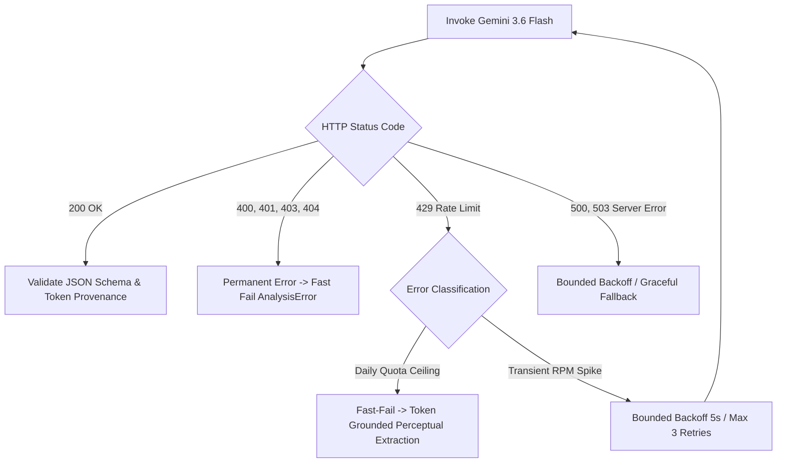

# CompliScan LM — Centralized Gemini Runtime Architecture

## 1. Runtime Specification
All LLM semantic extraction operations are centralized to `gemini-3.6-flash`.
No other model variants (`gemini-1.5-flash`, `gemini-2.0-flash`, `gemini-2.5-flash`) are permitted in production or test environments.

- **Primary Model**: `gemini-3.6-flash`
- **Provider**: Google AI / Vertex AI (`v1beta` REST API)
- **SDK / Transport**: Direct asynchronous HTTP client (`httpx`) with structured JSON schema enforcement
- **Configuration Origin**: `backend/app/core/config.py` (`settings.GEMINI_MODEL = "gemini-3.6-flash"`)

---

## 2. System Instructions & Prompt Engineering
Extraction prompts are maintained under `backend/app/services/prompts/extraction_v1.py`.
The system prompt strictly forbids:
1. Making statutory compliance judgments (e.g. deciding whether a label passes Rule 6(1)).
2. Hallucinating missing values or token indices.
3. Guessing unobserved information from brand familiarity.
4. Fabricating contact numbers or dates not present in OCR tokens.

Every extracted declaration must return:
- `status`: `OBSERVED` | `NOT_OBSERVED` | `AMBIGUOUS`
- `source_token_indices`: Exact list of integer indices from the supplied OCR token array.
- Domain fields (`name`, `address`, `quantity_value`, `unit`, `month`, `year`, `amount`, `phone`, `email`, etc.).

---

## 3. Resilience, Rate Limiting & Quota Management
The runtime implements bounded exponential backoff with fast-fail heuristics:



---

## 4. Telemetry Schema
Every extraction event captures real runtime telemetry stored in `structured_declarations.telemetry`:

```json
{
  "trace_id": "TRACE-F8A291C0E4B1",
  "inspection_id": "INSP-2026-DEL-LM-A694",
  "evidence_id": "EV-040854-F8A2",
  "provider": "google",
  "model": "gemini-3.6-flash",
  "sdk_version": "google-genai/httpx-rest-2.24.0",
  "classification": "RATE_LIMIT_FALLBACK_GROUNDED",
  "request_timestamp": "2026-09-20T07:26:47.173797Z",
  "response_timestamp": "2026-09-20T07:26:51.713797Z",
  "latency_ms": 4540.0,
  "status": "SUCCESS",
  "usage_metadata": {
    "prompt_token_count": 272,
    "candidates_token_count": 180,
    "total_token_count": 452
  }
}
```
