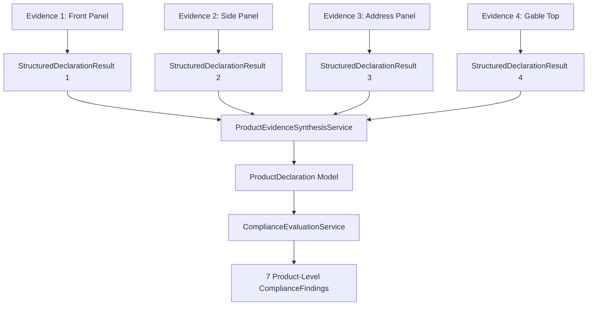

# CompliScan LM — Deterministic Multi-Image Synthesis Audit

## 1. Multi-Angle Package Evidence Problem
Consumer packages (such as tetra packs, bottles, and cartons) distribute mandatory Legal Metrology declarations across disparate physical panels:
- **Front Panel (PDP)**: Brand name, Generic commodity name, Net Quantity.
- **Side Panel**: Manufacturer, Packer, Importer name and full address, FSSAI license numbers.
- **Opposite Side Panel**: Consumer care telephone, email, address, and QR codes.
- **Top Gable / Fin Seal**: Batch number, Month/Year of packing, Maximum Retail Price (MRP).

Evaluating each image in isolation generates false positives (e.g. flagging MRP missing when evaluating only the front panel).
Averaging values using majority voting erases genuine label discrepancies (e.g. conflicting commodity names).

---

## 2. Deterministic Synthesis Architecture (Gates 1, 3, & 4)
The synthesis layer executes as an independent deterministic pipeline stage:



---

## 3. Conflict Detection without Majority Voting
`ProductEvidenceSynthesisService` collects observations for all 7 statutory fields:
1. **Unanimous Agreement**: All contributing images declare identical values $\rightarrow$ `observation_status = OBSERVED`, `corroborating_count = N`, contributing evidence IDs aggregated.
2. **Single Observation**: Exactly one image contains the declaration (e.g. MRP on gable top) $\rightarrow$ `observation_status = OBSERVED`, `corroborating_count = 1`.
3. **Discrepancy / Conflict**: Contributing images declare differing non-null values (e.g., front panel declares `"Real Fruit Power Mixed Fruit Juice"` while ingredients panel declares `"Mixed Fruit Beverage"`) $\rightarrow$ `observation_status = CONFLICTING`, `final_value = None`, `conflicting_evidence_ids = [EV-1, EV-2]`.
   - **No Heuristic Selection**: The system does NOT select the more common string.
   - **No Majority Voting**: The conflict is preserved and surfaced to the human reviewer for legal adjudication.

---

## 4. Synthesis Output Snapshot for Juice Package
From `post_remediation/product_declaration.json`:
- **Synthesis ID**: `PDEC-286BA3EE2A24`
- **Synthesis Version**: `v1.0`
- **Total Evidence Processed**: 4 Assets
- **Status**: `HAS_CONFLICTS` (Flagged for Reviewer Adjudication)

```json
{
  "commodity_name": {
    "observation_status": "CONFLICTING",
    "final_value": null,
    "corroborating_count": 1,
    "supporting_evidence_ids": ["EV-040854-F8A2"],
    "conflicting_evidence_ids": ["EV-040900-3D91"],
    "conflict_details": "Conflicting declarations across evidence: 'Real Fruit Power Mixed Fruit Juice' vs 'Mixed Fruit Beverage'"
  },
  "net_quantity": {
    "observation_status": "OBSERVED",
    "final_value": { "quantity_value": 1000.0, "unit": "ml" },
    "corroborating_count": 1,
    "supporting_evidence_ids": ["EV-040854-F8A2"]
  },
  "mrp": {
    "observation_status": "OBSERVED",
    "final_value": { "amount": 146.0, "currency": "INR", "includes_all_taxes_stated": true },
    "corroborating_count": 1,
    "supporting_evidence_ids": ["EV-040922-A1B2"]
  }
}
```
