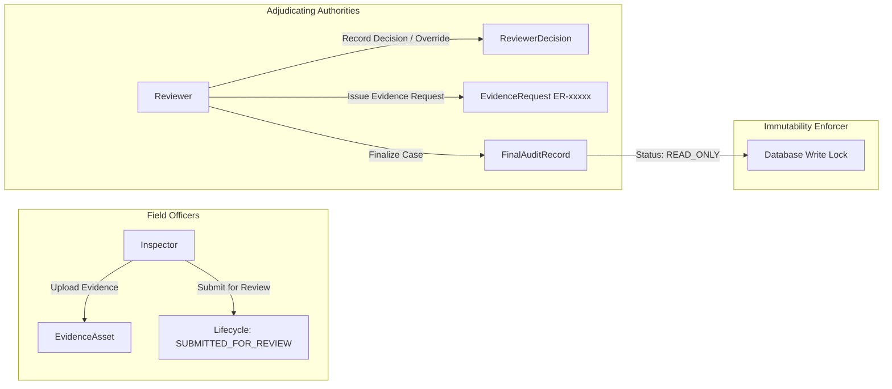

# CompliScan LM — Security, Governance & Immutability Audit

## 1. Security Architecture & Role Boundaries
CompliScan LM implements strict Role-Based Access Control (RBAC) separating administrative, investigative, and judicial responsibilities:

---

## 2. Security Controls Evaluated

### Control 1: Role-Based Access Control (RBAC)
- **Inspector Permitted**: Create inspection cases, upload evidence assets, trigger perception jobs, view automated findings, submit cases for review.
- **Inspector Forbidden**: Recording reviewer decisions, overriding compliance findings, executing finalization, generating finalized legal reports.
- **Reviewer Permitted**: Adjudicating findings, recording overrides with mandatory rationales, issuing evidence requests (`ER-xxxxx`), finalizing cases.
- **Verification**: Verified by `test_supabase_auth.py` and `test_phase4.py`.

### Control 2: Immutability of Finalized Cases (READ_ONLY Lock)
- Once finalized by `FinalizationService.finalize_inspection`:
  - `InspectionCase.status = "FINALIZED"`
  - `InspectionCase.finalization_status = "READ_ONLY"`
  - Any subsequent `POST`, `PUT`, `PATCH`, or `DELETE` attempt on evidence, declarations, or findings is aborted immediately with `HTTP 409 ConflictError ("Inspection is finalized and immutable (READ_ONLY)")`.
- **Verification**: Verified by `test_finalization_immutability_lock`.

### Control 3: Cryptographic Integrity Sealing
- `FinalAuditRecord` creates static, frozen JSON snapshots of:
  - `inspection_context_snapshot`
  - `evidence_snapshot` (with per-file SHA-256 hashes)
  - `declaration_snapshot` & `product_declaration_snapshot`
  - `applicability_snapshot`
  - `compliance_findings_snapshot`
  - `reviewer_decisions_snapshot`
- The composite hash is sealed:
  $$\text{Integrity Hash} = \text{SHA-256}(\text{EvidenceSnapshot} \parallel \text{FindingsSnapshot} \parallel \text{ReviewerDecisionsSnapshot})$$
- Sealed Hash for Juice Case `INSP-2026-DEL-LM-A694`:
  `7622493495e377248386ec480ed6f7659c6ad829fd81406bbb4b3e7f0ed1f3c6`

### Control 4: Secret Isolation & API Key Protection
- All Gemini API keys, Supabase credentials, and database connection strings are isolated in `.env` and injected via `backend/app/core/config.py`.
- No sensitive credentials or API keys are written to client bundles, logs, or exported report documents.
